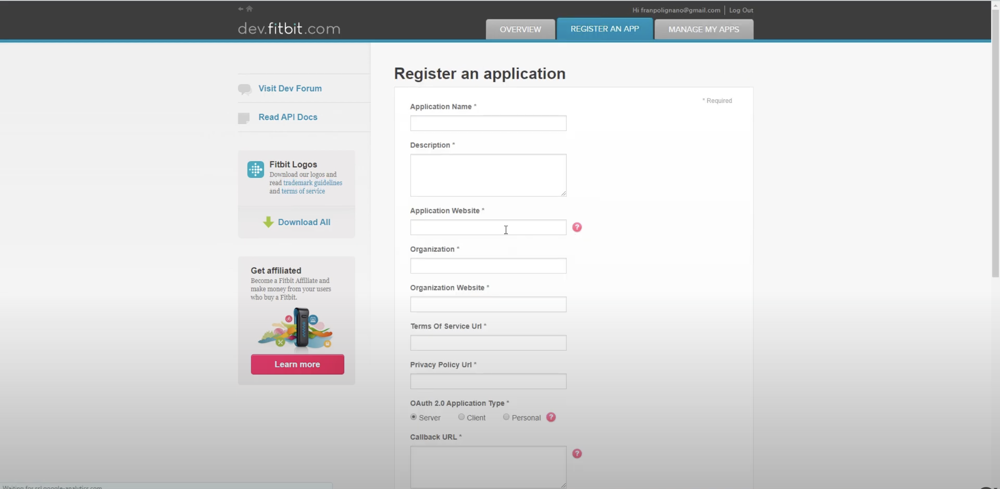
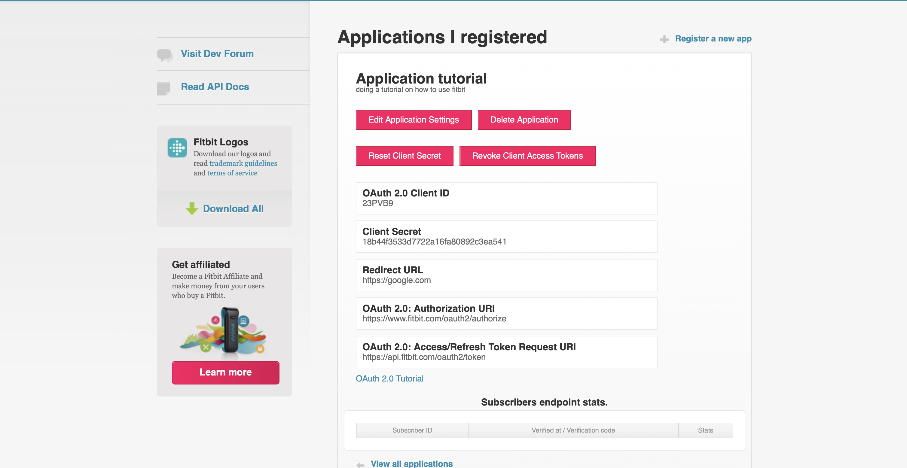

<div>
 
<center>
 
<h1>React Native Fitbit WebView</h1>

This package alllows  you access users fitbit health records including, sleep, heart rate, etc.  
 
  
</center>
 
</div> 
 

## [](https://github.com/just1and0/React-Native-Fitbit-WebView#Prerequisite)Prerequisite 
Before you can use this package you'd need to first setup a [Fitbit developer account](https://dev.fitbit.com/login) . once you have created your account. You'd neeed to *Register an application* and *Access your keys*
- [Register an application](https://dev.fitbit.com/apps/new)
 

| Field Name   |  Description   | 
|------------|------------| 
| Application Name | `string`| 
| Descripiton|  `string`: `must be at least 10 charaters`|  
| Application website|  `url string`: `must formatter as a url but doesn't need to be a valid url`|  
| Organisation |  `string`|  
| Organisation website|  `url string`: `must formatter as a url but doesn't need to be a valid url`|  
| Terms of Service Url|  `url string`: `must formatter as a url but doesn't need to be a valid url`|  
| Privacy Policy Url|  `url string`: `must formatter as a url but doesn't need to be a valid url`|  
| 0Auth 2.0 Application type|  `server: accessing user auth from a server`, `client: accessing user auth from a client`, `personal: only retrive my data` |  
| callback url|   `url string`: `must formatter as a url but doesn't need to be a valid url` |  
| Default Access Type|  `read & write`, `read-only` |  


- [Access your keys]()
 

 Once you create your app, you should be able to view the keys; for this project you'll need `CLIENT_ID`, `CLIENT_SECRET` & `REDIRECT_URL `
 

### [](https://github.com/just1and0/React-Native-Fitbit-WebView#installation)Installation

Add `react-native-fitbit-webview` to your project by running;

```bash 
npm install react-native-fitbit-webview

or

yarn add react-native-fitbit-webview
```
### **Additional Setup**

To ensure everything works smoothly, install and configure the required dependency, `react-native-webview`:

 
```bash 
yarn add react-native-webview
```
for iOS: 
```bash 
cd iOS && pod install && cd ..
```
for expo applications run;
```bash 
npx expo install react-native-webview
```
That’s it! You’re all set.
## [](https://github.com/just1and0/React-Native-fitbit-WebView#setup)Setup
Before you make use of the Hook, you'd need to setup your project to use the package, to do so;

```javascript
import React, { useEffect, useState } from 'react'; 
import MainNavigator from './src/navigation/MainNavigator'; 
import { FitbitProvider } from 'react-native-fitbit-webview'

function App(): React.JSX.Element { 
  return (
    <FitbitProvider 
     configs={{
        CLIENT_ID: '<your client_id here>',
        CLIENT_SECRET: '<your client_secret here>',
        FITBIT_MODAL_CONTROLS: {
            // set the color theme for the fitbit modal
          themeColor: colors.backgroundColor
        }
      }}> 
            <MainNavigator /> 
      </FitbitProvider> 
  );
}
export default App;
```

## [](https://github.com/just1and0/React-Native-fitbit-WebView#usage)Usage

### Authentication user. 
```javascript
import React, {useState} from 'react'; 
import { View } from 'react-native';
import {useFitbit} from 'react-native-fitbit-webview'

function AuthenticateUser() {
     const { authenticateUserFitbitAccount, usersFitBitAuthCredentials } = useFitbit();
    const [credentials, setCredentials] = useState(undefined)

     useEffect(()=>{
      if(!credentials){
          authenticateUserFitbitAccount()
      }
      if(){
        setCredentials(usersFitBitAuthCredentials)
      }
     },[])

  return (
    <View style={{ flex: 1 }}>
       <Text> Authenticate user's Fitbit account. </Text>
    </View>
  );
}
```

 ### Get user vitals. 
```javascript
import React from 'react'; 
import { View } from 'react-native';
import { useFitbitVitals } from 'react-native-fitbit-webview'

function ViewUserVitals() {
   
     const { usersFitBitAuthCredentials } = useFitbit();
      const { 
          fitBitDailySteps, 
          fitBitHeartRate, 
          fitBitCalories, 
          fitBitSleep  } = useFitbitVitals(usersFitBitAuthCredentials.access_token);
  
    return (
      <View style={{ flex: 1 }}>
          <Text> Authenticate user's Fitbit account. </Text>
      </View>
  );
}
```
---

## **API Reference**

#### Fitbit API
| Name                                 |                                                                                   use/description                                                                                   |                                                      extra |
| :----------------------------------- | :---------------------------------------------------------------------------------------------------------------------------------------------------------------------------------: | ---------------------------------------------------------: |
| `CLIENT_ID`                          |                                                 Fitbit app client ID, obtained from your Fitbit Developer Dashboard                                                                  |                                                     `nill` |
| `CLIENT_SECRET`                      |                                              Fitbit app client secret, obtained from your Fitbit Developer Dashboard                                                                 |                                                     `nill` |
| `FITBIT_MODAL_CONTROLS`              |                                             Configuration object for customizing the appearance of the Fitbit authentication modal                                                   |  default: `{ themeColor: "#000" }` |
| `authenticateUserFitbitAccount`      |                                  Function to trigger the opening of the Fitbit authentication modal and start the OAuth2 flow                                                        |                                                     `nill` |
| `closeModal`                         |                                                                       Function to close the authentication modal                                                                     |                                                     `nill` |
| `usersFitBitAuthCredentials`         |                                    Object containing the authenticated user’s Fitbit credentials, including access token, once the OAuth2 flow completes                              |                                                     `nill` |

---

#### Fitbit Vitals Hook API

| Name                                 |                                                                                   use/description                                                                                   |                                                      extra |
| :----------------------------------- | :---------------------------------------------------------------------------------------------------------------------------------------------------------------------------------: | ---------------------------------------------------------: |
| `accessToken`                        |                                                         The Fitbit OAuth2 access token required to fetch user vitals                                                                |                                                     `YES` |
| `fitBitDailySteps`                   |                                              Object representing the user’s daily steps fetched from the Fitbit API                                                                 |                                                     `nill` |
| `fitBitHeartRate`                    |                                               Object representing the user’s heart rate fetched from the Fitbit API                                                                 |                                                     `nill` |
| `fitBitCalories`                     |                                          Object representing the user’s calorie tracking data fetched from the Fitbit API                                                           |                                                     `nill` |
| `fitBitSleep`                        |                                      Object representing the user’s sleep analysis data fetched from the Fitbit API                                                                  |                                                     `nill` |

---

## [](https://github.com/just1and0/react-native-fitbit-webview#contributions)Contributions

Want to help improve this package? [Read how to contribute](https://github.com/just1and0/React-Native-fitbit-WebView/blob/main/CONTRIBUTING.md) and feel free to submit your PR!

## [](https://github.com/just1and0/React-Native-fitbit-WebView#licensing)Licensing

This project is licensed under the MIT License.

## Sponsorship
- Star the project on Github
- [Buy me a coffee](https://buymeacoffee.com/6pL0Q8YkW)

 